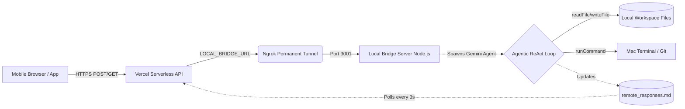

# 🚀 Antigravity Link: Mobile-to-PC Autonomous Agent

**Antigravity Link**는 모바일(스마트폰)에서 로컬 PC(Mac/Windows)의 텍스트 에디터나 워크스페이스를 원격으로 제어할 수 있는 **지능형 양방향 브릿지 시스템**입니다. 단순한 터미널 명령 전달을 넘어서, **내장된 Gemini ReAct 웹 에이전트**를 통해 폰 하나로 코드를 수정하고, 버그를 잡고, 실시간으로 배포할 수 있는 궁극의 미니 자율 코딩 환경을 제공합니다.

---

## ✨ 핵심 기능 (Features)

1. 🧠 **내장형 자율 에이전트 (Agentic Loop)**:
   - `local_bridge_subscriber.js` 코어에 **Google Gemini 2.5 Flash** 기반의 Function-Calling(툴 호출) 로직 탑재!
   - 모바일에서 *"로그인 버튼 파란색으로 고치고 깃허브 배포해"* 라고 명령하면, 백그라운드 에이전트가 스스로 파일 읽기(`readFile`), 수정(`writeFile`), 터미널 명령 실행(`runCommand`)까지 자율 수행 후 최종 결과를 당신의 폰에 보고합니다.

2. 📱 **모바일 최적화 및 양방향 통신 (Bidirectional Polling)**:
   - **Vercel**에 배포된 Next.js 프론트엔드를 통해 언제 어디서든 접속.
   - 명령 전송 시 미려한 [터미널 로딩 애니메이션] 적용! 백그라운드 에이전트가 묵묵히 코딩 작업을 완료하는 순간 로딩이 해제되며 상세 보고서가 출력됩니다.
   
3. 💾 **메모리 최적화 페이지네이션 (Load Previous Week)**:
   - 무한정 쌓이는 응답 로그를 한 번에 렌더링하지 않고, **가장 최근 7일치** 결과만 스마트하게 보여줍니다.
   - 오래된 내역이 필요할 경우 상단의 `↑ Load Previous Week` 버튼을 눌러 과거 역사를 안전하게 탐색할 수 있습니다.

4. 🌐 **영구적인 고정 URL 브릿징 (Ngrok Persistent Tunnel)**:
   - Ngrok 무료 고정 도메인을 `LaunchDaemon` 서비스로 등록하여, 컴퓨터 전원만 들어오면 언제든 모바일로 접속 가능한 절대 무적의 브릿지를 형성합니다.

---

## 🛠️ 시스템 아키텍처 (Architecture)



---

## 🚀 빠른 시작 가이드 (Quick Start)

### 1단계: 로컬 브릿지 서버(PC) 세팅
이 시스템의 두뇌 역할을 할 로컬 브릿지를 가동합니다. 폴더 내 `local_bridge_subscriber.js`가 위치한 곳에서 `.env` 파일을 생성하고 다음을 입력합니다:
```env
GEMINI_API_KEY=당신의_제미나이_발급_키
```
그리고 패키지를 설치한 뒤 서버를 시작합니다.
```bash
npm install express @google/generative-ai dotenv
node local_bridge_subscriber.js
```
*(기본 3001번 포트에서 브릿지가 활성화됩니다.)*

### 2단계: Ngrok 영구 백그라운드 터널 구축 (PC)
매번 바뀌는 URL 대신 평생 고정되는 터널을 Mac 백그라운드 서비스로 등록합니다.
1. [Ngrok 대시보드](https://ngrok.com)에서 발급받은 **고정 도메인(Static Domain)** 과 **토큰(AuthToken)** 을 확보.
2. 아래 명령어를 실행하여 3001 포트를 지정한 `ngrok.yml` 설정을 저장합니다:
```bash
cat << 'EOF' > "$HOME/Library/Application Support/ngrok/ngrok.yml"
version: "2"
authtoken: 본인의_토큰_붙여넣기
tunnels:
  antigravity-bridge:
    proto: http
    addr: 3001
    domain: 본인의_고정도메인.ngrok-free.app
EOF
```
3. Mac 백그라운드 서비스(LaunchDaemon)로 영구 등록 및 시작:
```bash
sudo ngrok service install --config "$HOME/Library/Application Support/ngrok/ngrok.yml"
sudo ngrok service start
```

### 3단계: 프론트엔드 Web App 배포 (Vercel)
마지막으로 Vercel에 올려둔 이 원격 조종 앱과 내 방의 Mac을 결합합니다.
1. Vercel 프로젝트 대시보드 → **Settings** → **Environment Variables**
2. `LOCAL_BRIDGE_URL` 변수에 아까 만든 Ngrok 도메인 주소(예: `https://본인도메인.ngrok-free.app`)를 입력.
3. Vercel에 접속하여 **Redeploy** 클릭!

---

## 🛡️ 제로-트러스트 보안 설정 (Security Hardening)

아무리 나만의 터널이라지만, Vercel 주소가 노출되면 누구나 로컬 PC의 터미널 쉘을 조종할 수 있는 위험이 있습니다. **Antigravity Link는 강력한 2중 보안을 제공합니다.**

### 1. Vercel 프론트엔드 비밀번호 잠금 (Basic Auth)
Vercel 대시보드의 **Environment Variables**에 다음 환경변수를 추가하면 앱 전체가 비밀번호로 잠깁니다.
- `AUTH_USER`: 접속 아이디 (예: `admin`)
- `AUTH_PASS`: 접속 비밀번호 (예: `supersecret123`)

### 2. 로컬 브릿지 API Key (통신 차단막)
프론트엔드가 뚫리거나 Ngrok 주소가 직접 노출되더라도, 로컬 PC 브릿지는 특정 **API Key**가 없으면 모든 요청을 거부(`401 Unauthorized`)합니다.
- **Mac 로컬 PC (`.env`)**: `BRIDGE_API_KEY=나만의_비밀키` 추가
- **Vercel (`Environment Variables`)**: `BRIDGE_API_KEY=나만의_비밀키` 추가

---

## 🎯 사용 방법 (Usage)

1. 휴대폰 사파리나 크롬에서 Vercel URL에 접속하세요! (`Antigravity Link` 화면이 뜹니다.)
2. (보안 설정 시) 아이디와 비밀번호를 입력하여 잠금을 해제합니다.
3. 드롭다운 목록에서 제어하고 싶은 "워크스페이스(폴더)"를 선택합니다.
4. 입력창에 자연어로 위대한 미션을 하명합니다:
   > "해당 폴더의 src/index.css 파일을 열고, 폰트는 Inter로 세팅한 다음, 푸른색 다크모드 그라데이션 UI를 배경에 입혀줘. 터미널 명령어로 빌드(npm run build)가 성공하는지도 체크 후 깃허브 메인 브랜치에 푸시해 주고 결과를 알려줘!"
5. **Send(보내기)!** 
   - 전송 후 3D 화면 속 에이전트가 격렬히 일하기 시작합니다! 백그라운드에서는 Gemini 자율 에이전트가 코드를 탐색하고 수정하며 터미널과 고군분투 중입니다.
   - 몇십 초 뒤, 폰에 완성된 결과 요약 보고서와 소스코드 내역이 출력됩니다!

---

### 만든이
**프로젝트**: Antigravity Link (Velvet Aphelion) 
**설계 및 구축**: 박재영 (jaeyoung) & Antigravity AI Agent
